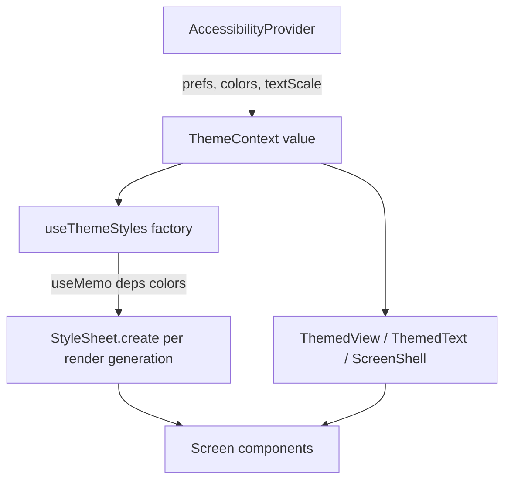

# Plan: Wire `useAccessibility().colors` into all StyleSheets

## Current state

| What works today | What does not |
|------------------|---------------|
| `Text` global scale via `maxFontSizeMultiplier` in `AccessibilityContext` | Module-level `StyleSheet.create({ … color: DS.color.gold })` is **frozen at import time** |
| `buildAccessibleColors(prefs)` in context | ~45 files still reference static `DS.color.*` |
| Web/marketing CSS via `applyAccessibilityWebSurface()` | Changing prefs does not recolor most native UI |

**Root cause:** `StyleSheet.create()` runs once per module load. Values like `DS.color.gold` are copied into the style object; later updates to `useAccessibility().colors` do not affect those entries.

---

## Target architecture



### 1. Add `useThemeStyles` (single hook, all screens)

**File:** `expo-app/src/theme/useThemeStyles.ts`

```typescript
export function useThemeStyles<T extends StyleSheet.NamedStyles<T>>(
  factory: (c: AccessibleColors, scale: number) => T,
): T {
  const { colors, textScale } = useAccessibility();
  return useMemo(() => StyleSheet.create(factory(colors, textScale)), [colors, textScale]);
}
```

- Screens move `const styles = StyleSheet.create(...)` **inside** the component (or a `function createStyles(c, scale)` at bottom of file).
- Replace `DS.color.text` → `c.text`, `DS.color.gold` → `c.gold`, etc.
- For font sizes that should respect Larger Text: `scaledFontSize(14, { textScaleLevel: … })` or pass `scale` into factory.

**Do not** mutate `DS.color` in place — that does not update existing StyleSheets.

### 2. Optional primitives (reduce churn)

| Component | Purpose |
|-----------|---------|
| `ThemedText` | Default `color={colors.text}`; optional `variant="muted" \| "gold"` |
| `ThemedView` | `backgroundColor={colors.background}` |
| `ScreenShell` | Root `flex:1` + safe background from `colors.background` |

Use primitives for new code; migrate hot paths first, not every `<Text>` at once.

### 3. Color token mapping

`AccessibleColors` extends `DS.color` + `emphasisBorder`. Map in factories:

| Static today | Themed |
|--------------|--------|
| `DS.color.background` | `c.background` |
| `DS.color.surface` / `surfaceAlt` | `c.surface` / `c.surfaceAlt` |
| `DS.color.gold` + tints | `c.gold`, `c.goldTint10`, `c.goldTint30` |
| `DS.color.text` / `textMuted` | `c.text` / `c.textMuted` |
| `DS.color.borderWhite5`, `postBorderGold20` | `c.borderWhite5`, `c.postBorderGold20` |
| `DS.apple.fillSecondary`, `separator` | Keep from `DS.apple` **or** add to `AccessibleColors` in phase 2 |

**Mono mode (`differentiateWithoutColor`):** `buildAccessibleColors` already remaps gold → white surfaces. Any hardcoded `#C8A84B` in JSX or StyleSheet bypasses this — grep and eliminate.

**Contrast mode:** Same hook; `c.background` becomes `#000000`, text brighter.

**Both toggles on:** Define precedence in `buildAccessibleColors` (recommend: mono wins, then contrast tweaks text/background).

### 4. Shared / third-party components

| File | Approach |
|------|----------|
| `AppleHeroButton` | `useThemeStyles`; `primary` uses `c.gold`, `secondary` border `c.goldTint30` |
| `ScreenHeader` | Themed title + border `c.borderHairline` |
| `AppNavigator` | `screenOptions` from hook or `navigationTheme` built from `colors` |
| `AppLoadingIndicator` | Spinner color `c.gold` |
| `PostFeedMedia`, `CaptionComposer` | Pass `colors` prop or internal hook |

### 5. Phased rollout (estimated)

| Phase | Scope | Files (~) | Outcome |
|-------|--------|-----------|---------|
| **0** | `useThemeStyles`, `ThemedText`, `ScreenShell`, doc | 3 new | Pattern established |
| **1** | Navigation + action chrome | `AppNavigator`, `ScreenHeader`, `ActionBanner`, `AppleHeroButton` | Tabs/header respond to a11y |
| **2** | Top traffic | `communityScreens`, `profileScreens`, `settingsDetailScreens`, `PublicProfileScreen`, `MemberProfileView` | Feed, profile, settings, DMs |
| **3** | Events, media, sponsors, proposals, master | `eventsScreens`, `mediaScreens`, `*Proposal*`, `masterControl*` | Rest of product |
| **4** | Onboarding, auth, paywall, admin | `onboardingScreens`, `GrantAccessScreen`, `PaywallScreen`, etc. | Full coverage |
| **5** | Guardrail | ESLint/custom script: flag `DS.color` inside `StyleSheet.create` at module scope | Prevents regression |

**Order rationale:** Phase 1 gives immediate visible feedback when toggling a11y in Settings; phase 2 is where users spend most time.

### 6. `communityScreens.tsx` strategy

Largest file (~4.9k lines). Do **not** one-shot refactor.

1. Extract style factory: `createCommunityStyles(c: AccessibleColors)`.
2. Split by feature: `feedStyles`, `inboxStyles`, `threadStyles` in separate files under `src/screens/community/`.
3. Each sub-screen calls `useThemeStyles(createFeedStyles)` locally.

### 7. Testing checklist

- [ ] Toggle **2× text** → feed, settings, thread readable; no clipped tab labels.
- [ ] **Differentiate without color** → gold buttons become white/black; post cards still bordered.
- [ ] **Sufficient contrast** → true black root; gold accents brighter.
- [ ] Web Expo: same as native; no flash of default theme on hydrate.
- [ ] Screenshot mode (`APP_STORE_SCREENSHOTS=1`) → unchanged or explicitly documented.

### 8. Performance

- `useMemo` on `StyleSheet.create` only when `colors` / `textScale` reference changes (prefs update).
- Avoid creating styles inside list `renderItem`; use screen-level hook once.

### 9. Out of scope (for this plan)

- Comment row avatars
- Marketing static HTML (already uses CSS variables)
- Rive/boot assets (brand colors fixed by design)

---

## Suggested first PR (Phase 0 + 1) — **implemented**

1. ✅ `src/theme/useThemeStyles.ts` + `ThemedText.tsx` + `ScreenShell.tsx`
2. ✅ `ScreenHeader`, `AppleHeroButton`, `ActionBannerProvider`
3. ✅ `AppNavigator` — `NavigationContainer` theme, tab bar tints, all stack `contentStyle`
4. ✅ `AccessibilityScreen` — dogfood toggles with themed chips/cards

**Next PR:** `profileScreens` + remaining settings/detail screens (Phase 2b).

### Phase 2 — community screens — **implemented**

1. ✅ `src/screens/community/createCommunityStyles.ts` — `createCommunityStyles(c)` (~1.9k lines)
2. ✅ `CommunityThemeProvider` + `useCommunityTheme()` in `CommunityStylesContext.tsx`
3. ✅ `AppNavigator` — `CommunityStackNavigator` wrapped in provider
4. ✅ `communityScreens.tsx` — module `StyleSheet` removed; all screens/components use `useCommunityTheme()`; JSX icons/placeholders use `colors.*`; demo notifications built via `buildNotificationDemoRows()` with themed body styles

**Verify:** Settings → Accessibility → toggle mono/contrast/text scale while on feed, inbox, thread, create post, search, notifications.

---

## References

- `expo-app/src/accessibility/AccessibilityContext.tsx` — `colors`, `textScale`
- `expo-app/src/lib/accessibilityTheme.ts` — `buildAccessibleColors`, `scaledFontSize`
- `expo-app/src/designSystem.ts` — static baseline tokens (keep as defaults inside `buildAccessibleColors`)
